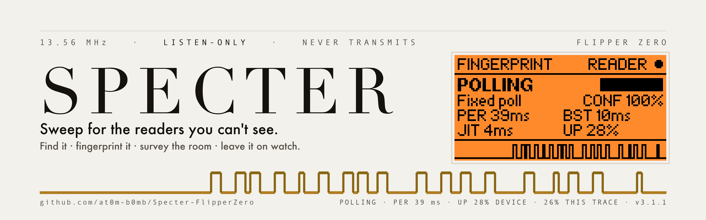
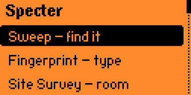
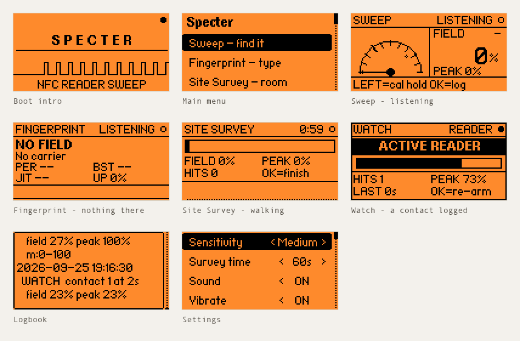
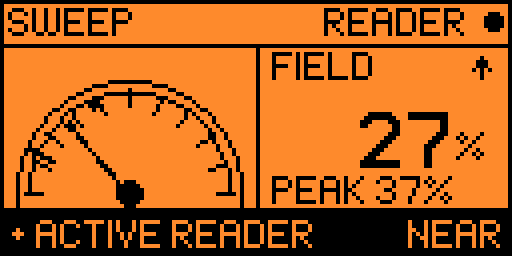
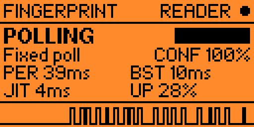
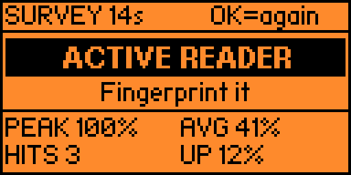
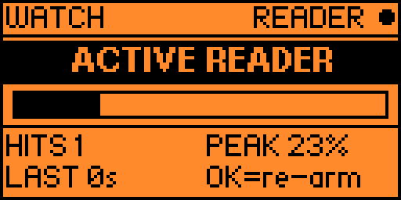
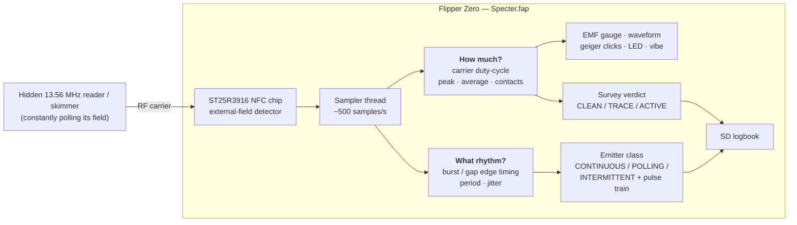

<!-- banner: paper by default, true black when the reader's GitHub is dark -->
<p align="center">
  <picture>
    <source media="(prefers-color-scheme: dark)" srcset="images/banner-dark.png">
    
  </picture>
</p>

<p align="center">
  <sub>
    The waveform is not a graphic. It is 128 columns of 13.56&nbsp;MHz carrier that
    Specter recorded off a real polling reader at 8&nbsp;ms per column, read back
    out of the screenshot beside it. Its duty measures 28% where the device's own
    counter printed 27%, and both numbers are on the banner.
  </sub>
</p>

<p align="center"><i>Sweep for the readers you can't see.</i></p>

<p align="center">
  <a href="https://at0m-b0mb.github.io/Specter-FlipperZero/"><b>Project site</b></a>
  &nbsp;·&nbsp;
  <a href="https://github.com/at0m-b0mb/Specter-FlipperZero/releases/latest">Download</a>
  &nbsp;·&nbsp;
  <a href="docs/changelog.md">Changelog</a>
</p>

<!-- live badges: these track the repo, so the README never goes stale -->
<p align="center">
  <a href="https://github.com/at0m-b0mb/Specter-FlipperZero/releases/latest"></a>
  <a href="https://github.com/at0m-b0mb/Specter-FlipperZero/releases"></a>
  <a href="https://github.com/at0m-b0mb/Specter-FlipperZero/stargazers"></a>
  <a href="https://github.com/at0m-b0mb/Specter-FlipperZero/actions/workflows/build.yml"></a>
</p>

<p align="center">
  
  
  
  
  
</p>

<p align="center">
  <b>Specter</b> turns your Flipper Zero into a pocket <b>counter-surveillance bug-sweep</b> for
  <b>active 13.56 MHz NFC readers</b>. It <i>passively listens</i> for the RF field that a powered-on
  reader is constantly emitting — a hidden card skimmer slipped into a payment terminal, a covert
  reader behind a door panel, a rogue logger taped under a desk — then tells you <b>where it is</b>,
  <b>what kind of thing it is</b>, <b>whether the room is clean</b>, and — left on watch — <b>the
  moment one appears while you're away</b>. It never transmits.
</p>

<p align="center"><sub>The readers are invisible. Specter makes them visible.</sub></p>

<p align="center">
  <sub>
    <b>As featured in</b><br>
    <a href="https://www.helpnetsecurity.com/2026/07/29/specter-flipper-zero-skimmer-detector/">Help Net Security</a>
    &nbsp;·&nbsp;
    <a href="https://cybersecuritynews.com/specter-with-flipper-zero/">Cyber Security News</a>
  </sub>
</p>

---

## On the Flipper

<p align="center">
  
</p>
<p align="center">
  <sub>A sweep, start to finish: quiet room → closing in → locked on → <b>what</b> it is → the room's verdict.</sub>
</p>

### The screens no single mode owns

<p align="center">
  <picture>
    <source media="(prefers-color-scheme: dark)" srcset="images/screens-dark.png">
    
  </picture>
</p>
<p align="center">
  <sub>
    The quiet states and the intro — the four modes below each carry their own
    capture, so these are the ones they do not. <b>Every image
    in this README is a capture off a real device</b>, taken over the Flipper's
    own RPC session by <code>tools_screenshot.py</code>. There is no mockup
    renderer in this project any more — a drawing of the UI is a second
    implementation of it, and it disagreed with the firmware while looking
    perfectly convincing (see <a href="docs/changelog.md">3.0.1</a>).
  </sub>
</p>

---

## The five modes

Specter is five tools around one sensor. Each answers a different question, so
the right one depends on what you are actually trying to find out:

| Mode | The question it answers | Use it when |
|---|---|---|
| **Sweep** | *Where is it?* | You suspect a device and want to pinpoint it by moving around |
| **Fingerprint** | *What kind of thing is it?* | You have found an emitter and want to know how it behaves |
| **Site Survey** | *Is this room clean?* | You want one verdict for a whole space, hands-free |
| **Watch Mode** | *Did one appear while I was away?* | You are leaving the Flipper somewhere to stand guard |
| **Logbook** | *What did I find, and when?* | You are writing it up, or comparing today with last week — filter by finding type |

---

### Sweep — *where is it?*



**What it does.** A live EMF-style meter. Hold the Flipper flat and move it slowly
over the thing you're checking — a card terminal, a door reader, the underside of
an ATM lip, a parcel, a desk. The needle rides the field strength in real time.

**What you see.**
- **The dial** — needle = live reading, the small dot = *peak-hold* (the strongest
  spot you've touched, so you can compare positions).
- **`FIELD %`** — the same reading as a number, with a **▲ / ▼ trend arrow**
  telling you whether the last half-second made things *warmer or colder*. When
  you're hunting, that arrow matters more than the number.
- **`PEAK %`** — the strongest reading since you armed, the number behind the
  peak-hold dot.
- **The mark across the dial** — where `READER` *begins* at your current
  sensitivity. Everything past it is what Specter will call a hit, so the dial
  answers "what counts?" instead of leaving you to guess.
- **Bottom strip** — until you've found your first reader it carries the two keys
  you can't discover by pressing things (`LEFT=cal`, `hold OK=log`); after that,
  your sensitivity and a live waveform. It flips to a black
  **`● ACTIVE READER`** alarm bar with a proximity word the moment a carrier is
  detected.
- **Proximity** — `FAINT → NEAR → CLOSE → STRONG → PEGGED`. `PEGGED` means the meter is
  *pegged*: you're as close as this measurement can resolve.

**Sound.** Optional geiger clicks that **speed up as you get closer**, so you can
sweep with the Flipper in your pocket and hunt by ear alone.

| Key | Action |
|---|---|
| `OK` | Reset peak-hold and contact count |
| `hold OK` | Save this reading to the logbook |
| `LEFT` | Calibrate to the room's noise floor (3 s) |
| `UP` / `DOWN` | Step sensitivity without leaving the hunt |

<br clear="right">

### Fingerprint — *what kind of thing is it?*



**What it does.** Once Sweep has found something, hold the Flipper **still**
against it. Fingerprint stops measuring proximity and starts **timing the
carrier's on/off edges**, which is what actually distinguishes one kind of
emitter from another.

**What you see.** A verdict, a confidence bar, and the evidence behind both:

| Class | What it means in practice |
|---|---|
| **CONTINUOUS** | The carrier is held permanently up |
| **POLLING** | A fixed, crystal-timed poll cycle — the period is shown in ms |
| **INTERMITTENT** | Bursty but irregular — often a phone or a reader in use |

Underneath are `PER` (poll period), `BST` (burst width), `JIT` (jitter) and
`UP` (true duty-cycle), plus a **logic-analyser pulse train** of the raw
carrier — so the verdict is never something you have to take on faith. A genuine
polling reader shows up as an unmistakable square wave.

> A `~` before a timing means it's close to the 2 ms sampling floor, and the
> confidence is discounted to match.

| Key | Action |
|---|---|
| `OK` | Save the finding to the logbook |
| `hold OK` | Restart the measurement |

<br clear="right">

### Site Survey — *is this room clean?*



**What it does.** A **timed** sweep of a whole space. Start it, walk the room
normally, and get a single verdict at the end — no needle-watching.

**What you see.** A countdown and progress bar while it runs, then a verdict card:

- **`CLEAN`** — nothing crossed the noise floor
- **`TRACE`** — brief or faint hits; worth a slower second pass
- **`ACTIVE READER`** — something was genuinely up and emitting
- **`TOO SHORT`** — you stopped it before it had earned the right to say `CLEAN`

…with `PEAK` / `AVG` field, contact count, and `UP %` — **how much of the survey
a carrier was actually up**, which is often the most telling number of the four.
Runs for 30 s, 60 s or 2 min, and logs the result automatically. The card names
the length it was graded over, because a 30-second `CLEAN` is not the same
finding as a two-minute one — and a run cut shorter than 10 s reports
`TOO SHORT` instead of `CLEAN`. The asymmetry is deliberate: **presence is
proof, absence is not.** Finding something in one second is a real finding, so
`TRACE` and `ACTIVE READER` are never withheld for being quick; finding nothing
in one second is a claim about the whole room that one second cannot support.

| Key | Action |
|---|---|
| `OK` *(running)* | Stop now and grade what it has |
| `OK` *(on the card)* | Run another survey |

<br clear="right">

### Watch Mode — *did one appear while I was away?*



**What it does.** Stands guard **indefinitely**. Arm it, set the Flipper down,
walk away. Where Sweep is you hunting and Survey is a fixed-length test, Watch
just waits — for minutes or hours.

**What you see.** A large elapsed clock and `NO READER` while nothing is there.
The instant a reader appears the band inverts to **`ACTIVE READER`**, a strength
bar shows how close it is, the **screen wakes**, and the alarm sounds. The band
is steady rather than flashing — on a 1-bit screen a solid inverted block is
already the loudest thing on it, and the readouts that genuinely change carry
the liveness. After it passes, the screen keeps the evidence: `HITS` (how many
separate contacts), `PEAK`, `LAST` (how long ago the most recent one was) and
`UP` (total time a carrier was actually up). The clock rolls over to `hh:mm`
past 99:59 rather than freezing, so an overnight watch still adds up.

Watch **deliberately ignores stealth mode** — a dark, silent guard that never
tells you it saw something would be worse than useless.

| Key | Action |
|---|---|
| `OK` | Re-arm — clears the clock and counters |

<br clear="right">

### Logbook — *what did I find, and when?*

Findings are saved **twice, from one action**, so they're readable on the device
*and* already a spreadsheet — no export step to remember:

<table>
<tr><th><code>logbook.txt</code> — grouped, for the on-device viewer</th><th><code>logbook.csv</code> — one flat row per entry</th></tr>
<tr><td>

```
2026-07-18 14:35:11
  SURVEY 60s ACTIVE max74…
2026-07-18 14:32:07
  READER POLLING 204ms…
```

</td><td>

```
timestamp,type,detail
2026-07-18 14:35:11,SURVEY,60s ACTIVE …
2026-07-18 14:32:07,READER,POLLING 204ms …
```

</td></tr>
</table>

Entries are tagged `SWEEP`, `READER`, `SURVEY` or `WATCH` and stamped from the
Flipper's clock. Both files live in `apps_data/specter/` on the SD card. Nothing
ever leaves the device. Clear them from **Settings → Clear logbook** (confirmed
first — it's the one irreversible thing the app can do).

---

## The supporting bits

### Auto-calibration

Press **LEFT** on the Sweep screen and Specter listens to the **ambient noise
floor for 3 seconds**, then sets the detection threshold just above whatever it
measured — saved as your **Custom** sensitivity. Every room has a different RF
floor; this tunes to the one you're standing in rather than a number baked in at
build time. Stand somewhere quiet when you run it.

### Stealth mode

Keeps the **screen and LED dark** for the whole sweep, so the Flipper doesn't glow
while you're the one doing the looking. Sound and vibration keep working — the
point isn't to disable the feedback you're sweeping by. Exiting a stealth screen
re-lights the display, so `BACK` always lands you on a lit menu.

### Reading the meter

**Why a reader you're touching doesn't emit 100% of the time.** The detector
measures one physical thing: what fraction of the time a 13.56 MHz carrier is up.
But readers **poll** — a short burst, a sleep, another burst. A typical terminal
is only radiating **20–35% of the time**, so raw duty-cycle *saturates* around 30%
no matter how close you get.

Showing that raw number on the gauge made a perfect detection look like a third
of one. The meter is scaled against that real polling band instead:

| Raw carrier duty | Meter | Proximity |
|---|---|---|
| 3% (room noise) | 10% | `FAINT` |
| 12% | 40% | `NEAR` |
| 20% | 67% | `CLOSE` |
| 28% | 93% | `STRONG` |
| ≥30% *(resting on a reader)* | **100%** | `PEGGED` |

The **raw duty is never lost**: the noise floor, auto-calibration and the
Fingerprint screen's `UP` all still work in true duty-cycle, because those
describe the *signal*, not your distance from it. Want the literal number?
**Settings → Meter scale → Duty %**.

### Everything persists

Sensitivity, survey length, sound, vibe, LED, stealth, logging and meter mode are
**saved to the SD card** the moment you change them. A sweep kit that forgets its
setup is worse than no persistence at all.

---

## How it works

Every powered-on NFC reader continuously **pings the air with a 13.56 MHz carrier**, waiting for a card
to wake up. You can't see it, but the Flipper's NFC chip can: the **ST25R3916** has a hardware
**external-field detector** (the same circuit that lets the Flipper emulate a card and know when a reader
is talking to it). Specter parks the chip in detect-only mode and **samples that "field present?" bit
~500 times a second** — without ever switching on its own carrier.

That single bit, sampled fast enough, carries two independent signals:



**How much → strength.** Over a short window Specter measures *what fraction of the time* a carrier is
present and smooths it into the **FIELD %**. A reader sitting right on top of the Flipper pegs the meter;
a weaker or further one nudges it. That drives the needle, the proximity word and the click rate.

**What rhythm → identity.** Separately, every transition of that bit is timed. A reader that wakes for
20 ms every 200 ms produces a burst/gap pattern with almost no jitter, because its polling loop is
driven by a crystal-timed state machine. Hand movement and RF noise are not that steady. That
difference is what separates **POLLING** from **INTERMITTENT**.

### The decision layers are tested on a real computer

The places where Specter turns numbers into a *claim* — "this is a polling reader", "this room is
clean", "this is what the needle should read" — are pure C with no hardware dependencies, and they're
pinned down by host tests rather than discovered on the device:

```bash
make -C test     # 527 checks: classifier, verdict, meter scaling, presence,
                 #             cadence, log filtering, log wrapping
```

---

## Install

No devboard, no firmware to flash — it's a single `.fap`.

**Option A — prebuilt `.fap` (easiest)**

1. Grab the right `.fap` from the [**Releases**](https://github.com/at0m-b0mb/Specter-FlipperZero/releases) page:

   | Your firmware | File |
   |---|---|
   | **Official / stock** | `specter.fap` |
   | **Unleashed, RogueMaster, Momentum** or anything newer | `specter-fw-dev.fap` |

   > If the Flipper says **`APP:87 < FW:88 — This app might not work`**, you have the
   > wrong one — take the other file. The app's API version is fixed when it's compiled,
   > so a single build can't satisfy both firmware lines. It usually still runs if you
   > press Continue, but the matching build won't ask.
2. Open **qFlipper**, drag the file onto `SD Card / apps / NFC /`.
3. On the Flipper: **Apps → NFC → Specter**.

**Option B — build it yourself with [`ufbt`](https://github.com/flipperdevices/flipperzero-ufbt)**

```bash
# one-time
python3 -m pip install --upgrade ufbt

# from the repo root, with your Flipper plugged in over USB:
ufbt            # build specter.fap into ./dist
ufbt launch     # build, upload to the Flipper and open it
make -C test    # run the host tests for the pure logic
```

The `.fap` lands in `dist/specter.fap`; `ufbt launch` copies it to `apps/NFC/` and starts it for you.

> Icons in `icons/` and the banner in `images/` are generated — regenerate with
> `python3 tools_gen_icons.py` and `python3 tools_gen_banner.py` (needs `pillow`).
> Everything in `screenshots/` is captured from a real device with
> `python3 tools_screenshot.py` (needs `pyserial` and a Flipper on USB).

---

## Using it

**A sweep, end to end:**

1. Launch **Specter**. On the **Sweep** screen, press **LEFT** and hold still for 3 seconds to
   calibrate to the room's noise floor.
2. Hold the Flipper flat and move it **slowly** across the thing you're checking — a card terminal, a
   door reader, the underside of an ATM lip, a parcel, a desk.
   - **Quiet / flat waveform** → no active reader in range.
   - **Needle climbing, clicks speeding up** → you're approaching an emitter. Keep going toward the peak.
   - **`● ACTIVE READER` + alarm border** → an active reader is right here.
3. Found something? Back out and open **Fingerprint**. Hold the Flipper still against it and let the
   cadence settle — a few seconds is usually enough. Press **OK** to save the finding.
4. Clearing a whole room instead? Open **Site Survey**, walk the space until the bar fills, and read
   the verdict.
5. Leaving the area? Drop the Flipper in **Watch Mode** and it'll stand guard, waking and sounding off
   if a reader turns up while you're gone.
6. Check **Logbook** for everything you've saved, timestamped — or pull `logbook.csv` off the card
   into a spreadsheet.

> Sweep a known-good reader first (your own phone doing NFC, or a contactless terminal you trust) to
> see what a strong, legitimate field looks like on the meter — and what its fingerprint reads as. Then
> go hunting.

### Controls

| Screen | Key | Action |
|---|---|---|
| **Sweep** | `OK` | Reset peak / contacts |
| | `hold OK` | Log the current reading |
| | `LEFT` | Calibrate the noise floor (3 s) |
| **Fingerprint** | `OK` | Save the finding to the logbook |
| | `hold OK` | Restart the measurement |
| **Site Survey** | `OK` | Run the survey again |
| **Watch Mode** | `OK` | Re-arm (clear count and clock) |
| *anywhere* | `BACK` | Up a level |

---

## Honest limitations

- **13.56 MHz (HF) only.** Specter senses the **NFC band** — the one used by contactless payment skimmers,
  most modern access readers, transit and hotel readers. It **cannot** see **125 kHz (LF)** readers
  (older HID Prox / EM4100 door panels); the Flipper's LF path has no equivalent field-detect bit.
- **It senses a reader's *carrier*, not what it reads.** Specter tells you *an active reader is here,
  roughly how close, and what rhythm it polls on* — it does not decode, identify, or capture anything
  the reader does.
- **Strength is relative, not calibrated.** `FIELD %` and the proximity words are a comparative "warmer /
  colder" guide for sweeping, not a measured distance in cm. It's a *scaled* reading of carrier
  duty-cycle against a typical polling band (see [Reading the meter](#-reading-the-meter--fixed-in-23));
  a reader that polls unusually sparsely will read lower at the same distance, and one in continuous-wave
  mode will peg from further away.
- **The meter tops out.** `PEGGED` means the carrier is up as much as this reader ever keeps it up — past
  that point, closing in genuinely cannot produce a bigger number. The Flipper buzzes once when it happens,
  so you know to stop moving even when you can't see the screen. Use the `PEAK` hold to compare
  positions instead.
- **Cadence resolves to ~2 ms.** That's the sampling period. Timings anywhere near it are shown with a
  **`~`** and the confidence is discounted accordingly — Specter would rather flag its own resolution
  floor than quote a precise-looking number it can't stand behind.
- **`CLEAN` means clean at the sensitivity you chose.** A dormant skimmer that only wakes on a real tap,
  or one that's shielded, stays invisible at *any* threshold. Absence of a reading isn't a guarantee of
  absence.
- **One radio at a time.** Specter takes over the NFC chip while sweeping, so close any other NFC app first
  (it'll say *NFC unavailable* if something else holds the radio).

---

## Legal & ethical

Specter is a **defensive, listen-only** tool — it **never transmits**, never powers a field, never touches
the reader. Use it to sweep **your own** POS area, door, desk or belongings, or hardware you're **explicitly
authorised** to assess. You are responsible for how you use it. Know your local laws.

---

## Roadmap

- [x] Persist sensitivity / sound / vibe / LED across reboots
- [x] "Logbook" of detections with timestamps to the SD card
- [x] Background sweep with the screen off — *stealth mode*
- [x] Adjustable threshold for finer range control — *auto-calibration + Custom sensitivity*
- [x] Fingerprint an emitter by its polling cadence
- [x] Timed site survey with a room verdict
- [x] Export the logbook as CSV for reporting — *written live alongside the .txt*
- [x] Long-run unattended watch mode with a wake-on-detection alarm
- [x] Make the meter use its full range against real polling readers
- [x] Warmer/colder trend arrow while hunting
- [ ] Investigate an LF (125 kHz) coil-based reader sense as a separate mode
- [ ] On-device logbook filtering by type

---

## Project layout

```
Specter-FlipperZero/
├── application.fam               # Flipper app manifest (category: NFC)
├── specter.c / specter_i.h       # app entry, wiring, alert feedback, stealth
├── helpers/
│   ├── field_detector.{c,h}      # worker thread: samples the field-present bit,
│   │                             #   duty-cycle + edge timing + calibration
│   ├── emitter_classify.{c,h}    # pure: cadence -> CONTINUOUS/POLLING/INTERMITTENT
│   ├── survey_verdict.{c,h}      # pure: survey stats -> CLEAN/TRACE/ACTIVE
│   ├── field_scale.{c,h}         # pure: raw carrier duty -> full-scale meter
│   ├── present_hold.h            # pure: debounce presence across poll gaps
│   ├── cadence.h                 # pure: burst/gap/period timing with liveness
│   ├── ema.h                     # pure: the strength smoother
│   ├── log_filter.h              # pure: keep only one kind of finding
│   ├── log_wrap.h                # pure: wrap an entry at words, not mid-word
│   ├── specter_settings.{c,h}    # persisted settings (saved_struct)
│   └── specter_log.{c,h}         # SD logbook, RTC-stamped .txt + live .csv
├── views/
│   ├── view_chrome.h             # the header, presence dot and error screen
│   │                             #   every measurement view shares
│   ├── sweep_view.{c,h}          # the EMF gauge / waveform / alarm screen
│   ├── fingerprint_view.{c,h}    # classification card + pulse-train trace
│   ├── survey_view.{c,h}         # progress + verdict card
│   └── watch_view.{c,h}          # unattended guard: clock + count + alarm
├── scenes/                       # scene-manager navigation
├── test/                         # host tests for the pure decision layers
├── icons/                        # 1-bit Flipper icons (generated)
├── images/                       # banner, mark and social card (generated), plus
│                                 #   device_*.png: real captures off a Flipper
├── screenshots/                  # the six captures the Apps Catalog listing uses
├── docs/catalog/                 # the prepared catalog manifest + how to submit
├── tools_check_layout.py         # static overlap + clearance checker (CI-gated)
└── tools_gen_*.py                # regenerate icons / mockups / banner / GIF
```

---

## Branding

**BACKLIGHT.** Set in **Didot** for identity, **Futura** for voice, **Andale Mono**
for every measured value. The orange is `#FE8A2C` — *sampled* from a qFlipper
capture of this app running, so it is the Flipper's own backlight rather than a
colour chosen to resemble it. Every capture in `screenshots/` is exactly two
colours, `(254,138,44)` and `(0,0,0)`; that is what the hardware emits.

It is never used as a brand colour. **The only ember on any asset is light the
device actually emitted** — pixels inside a real capture, pasted untouched at an
integer scale. Artwork is drawn in the same hue fifteen degrees cooler. One ramp,
read from opposite ends: **more ink means more signal on paper, more light means
more signal on black** — because paper is where a sweep ends (Specter writes a
timestamped logbook you can hand to someone) and black is where it happens
(stealth mode forces the backlight off).

The accent draws one thing and nothing else: **measured carrier.** It is never a
rule, a frame, a margin or a word — there are no gold words anywhere in the
system, and the renderer raises if one is attempted. So the banner carries
exactly one accent-coloured object, and that object is a measurement.

The waveform is 128 columns of carrier Specter recorded off a real polling reader
at 8 ms per column, scraped back out of the screenshot beside it. The flat run at
the left is the trace buffer before it filled, not silence anyone measured. Its
duty reads **28%** where the device's own counter printed **27%**, and both
numbers are on the banner. The mark is one poll cycle at **30%** duty — that
reader's 12 ms of 40 ms, and also `SPECTER_FULL_SCALE_DUTY`, the duty at which
the meter reads 100%. One number, two independent reasons to be it.

`#FE8A2C` is the only colour here we did not choose.

| Asset | Size | Where it goes |
|---|---|---|
| `images/banner.png` | 2560×800 | README header, paper ground (2× so it stays crisp on retina) |
| `images/banner-dark.png` | 2560×800 | The same drawing on true black, served by `<picture>` to dark-mode readers |
| `images/social-preview.png` | **1280×640** | **Settings → Social preview** — GitHub's recommended size (min 640×320, 1 MB cap) |
| `images/mark.png` | 512×512 | Square logo mark: social posts, slides, favicon. **Not a repo avatar** — GitHub shows the *owner's* profile picture next to a repo, so there is no per-repo avatar to set |
| `images/mark-180/64/32/16.png` | as named | 180 and 64 downscaled; **32 and 16 are drawn natively** so nothing anti-aliases into mush |
| `images/demo.gif` | 384×192 | A scripted walk through every mode, **recorded off the device** — `tools_screenshot.py --tour-gif` |
| `images/splash.gif` | 384×192 | The boot intro, recorded from the launch request onwards — `--splash` |
| `images/screens.png` | — | Contact sheet of the captures, light ground, rebuilt by `--sheet` |
| `images/screens-dark.png` | — | The same sheet on true black, served by `<picture>` to dark-mode readers |
| `screenshots/*.png` | 512×256 | **Every screen, captured off a real device** over RPC. Exactly two colours: the panel's own. |

```bash
python3 tools_brand_data.py          # the facts the branding is allowed to state
python3 tools_gen_banner.py          # banner (light + dark), social preview, logo mark
python3 tools_gen_icons.py           # 1-bit Flipper icons

# these need a Flipper on USB (pip install pyserial)
python3 tools_screenshot.py --all      # walk every screen and capture it
python3 tools_screenshot.py --reader   # the shots that need a live reader
python3 tools_screenshot.py --splash   # the boot intro
python3 tools_screenshot.py --tour-gif # one GIF of the app being used
```

> The social preview is the one asset GitHub can't pick up from the repo — it has
> to be uploaded once by hand in **Settings → Social preview**. It's what renders
> when the repo is shared on Slack, X, LinkedIn or Discord.

---

## Credits

- Built by **[at0m-b0mb](https://github.com/at0m-b0mb)**.
- Part of a Flipper security-tool family: **[Argus](https://github.com/at0m-b0mb/Argus-FlipperZero)** (Wi-Fi deauth / evil-twin watchdog), **[GhostTag](https://github.com/at0m-b0mb/GhostTag-FlipperZero)** (BLE anti-stalking hunter) and **[Cerberus](https://github.com/at0m-b0mb/flipper-cerberus)** (Sub-GHz RF watchdog).
- Powered by the [Flipper Zero firmware](https://github.com/flipperdevices/flipperzero-firmware) NFC HAL (`furi_hal_nfc` field detection) + [ufbt](https://github.com/flipperdevices/flipperzero-ufbt).

## License

[MIT](LICENSE) © 2026 at0m-b0mb
